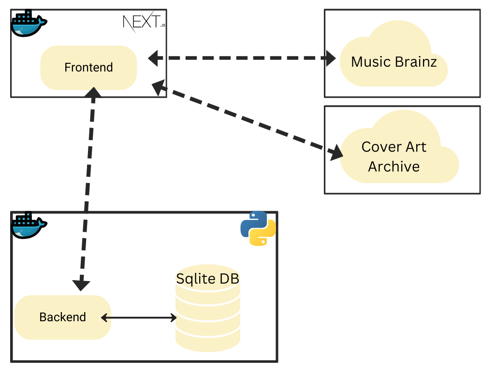

# Projeto MPV em Arquitetura de Software (Songboxd) - Backend

Este é o backend do MVP em Arquitetura de Software para a pós-graduação em engenharia de software da PUC-RJ desenvolvido com FastAPI. O backend é responsável pela persistência e autenticação de usuários. Para rodar o projeto, basta ter o Docker e o Docker Compose instalados e executar os comandos `docker-compose build` e `docker-compose up`.

## Tabela de Conteúdos

1. [Pré-requisitos](#pré-requisitos)
2. [Estrutura do Projeto](#estrutura-do-projeto)
3. [Configuração](#configuração)
4. [Desenvolvimento](#desenvolvimento)
5. [Uso](#uso)
6. [Dockerfile](#dockerfile)
7. [docker-compose.yml](#docker-composeyml)
8. [Critérios Avaliativos](#critérios-avaliativos)
9. [Vídeo](#vídeo)

## Pré-requisitos

Antes de começar, você precisará ter as seguintes ferramentas instaladas em sua máquina:

- [Docker](https://www.docker.com/get-started)
- [Docker Compose](https://docs.docker.com/compose/install/)

## Estrutura do Projeto

- `Dockerfile`: Define a imagem Docker para a aplicação.
- `docker-compose.yml`: Define os serviços Docker para desenvolvimento.
- `.dockerignore`: Arquivos e diretórios a serem ignorados pelo Docker.
- `app/`: Diretório principal contendo a aplicação FastAPI.
  - `main.py`: Arquivo principal que define a aplicação FastAPI.
  - `models.py`: Define os modelos de dados.
  - `database.py`: Configuração do banco de dados.
  - `auth/`: TODO.
    - `auth.py`: Define as funções principais para autenticação de usuários, incluindo criação de tokens JWT, verificação de credenciais, e recuperação de informações do usuário atual.
    - `schemas.py`: Define os modelos Pydantic usados para validação e serialização de dados relacionados à autenticação e usuários.
    - `utils.py`: Fornece utilitários para verificação e hashing de senhas usando a biblioteca 
  
## Configuração

1. Clone o repositório:

   ```bash
   git clone https://github.com/pedro-git-projects/puc-mvp-software-architecture-persistence.git
   cd puc-mvp-software-architecture-persistence
   ```

## Desenvolvimento

Para rodar a aplicação em modo de desenvolvimento, use o Docker Compose:

1. Construa a imagem Docker:

   ```bash
   docker-compose build
   ```

2. Inicie a aplicação:

   ```bash
   docker-compose up
   ```

A aplicação estará disponível em [http://localhost:8000](http://localhost:8000).

## Uso

1. **Cadastro de Usuário**:
   - Envie uma requisição POST para `/users/` com os dados do usuário para criar uma nova conta.

2. **Login**:
   - Envie uma requisição POST para `/token` com as credenciais do usuário para obter o token de autenticação.

3. **Obter Perfil do Usuário**:
   - Envie uma requisição GET para `/users/me/` com o token de autenticação para obter os dados do perfil do usuário.

4. **Deletar Conta do Usuário**:
   - Envie uma requisição DELETE para `/users/me` com o token de autenticação para deletar a conta do usuário.

## Dockerfile

O `Dockerfile` utilizado para a construção da imagem Docker:

```Dockerfile
FROM python:3.10

WORKDIR /app

COPY requirements.txt .

RUN pip install --no-cache-dir -r requirements.txt

COPY . .

CMD ["uvicorn", "app.main:app", "--host", "0.0.0.0", "--port", "8000"]
```

## docker-compose.yml

Arquivo `docker-compose.yml` para desenvolvimento:

```yaml
FROM python:3

WORKDIR /app

COPY requirements.txt .

RUN pip install --no-cache-dir -r requirements.txt

COPY . .

CMD ["uvicorn", "app.main:app", "--host", "0.0.0.0", "--port", "80"]
```

## Critérios Avaliativos

- "A interface do usuário deve fazer chamadas a pelo menos 5 rotas diferentes."

| Rota                                    | Método  | Propósito                                                      |
|-----------------------------------------|---------|----------------------------------------------------------------|
| `/token`                                | POST    | Obter o token de autenticação para login.                      |
| `/users/`                               | POST    | Criar um novo usuário.                                         |
| `/users/me`                             | DELETE  | Deletar a conta do usuário logado.                             |
| `/users/me/`                            | GET     | Obter o perfil do usuário logado.                              |
| `/users/me/password`                    | PUT     | Alterar a senha do usuário logado.                             |
| `/users/me/favorites`                   | POST    | Adicionar um item aos favoritos do usuário logado.             |
| `/users/me/favorites`                   | GET     | Obter a lista de favoritos do usuário logado.                  |
| `/users/me/favorites/{album_id}`        | DELETE  | Remover um item dos favoritos do usuário logado pelo ID do álbum. |

As rotas e métodos adicionados refletem operações de alteração de senha, adição e remoção de favoritos, além de recuperar a lista de favoritos do usuário logado. Essas funcionalidades foram identificadas a partir das funções de API que você forneceu no código Python.

- "Será permitido a utilização de bibliotecas ou frameworks baseadas em Python, como o FastAPI, SQLAlchemy, e outras"

A aplicação é desenvolvida com FastAPI e SQLAlchemy.

- "Uso de uma API externa pública e que ofereça um serviço não pago." 

Foram utilizadas duas APIs públicas, **Music Brainz** e **Cover Art Archive**, para mais informações, por favor checar o README do repositório do [frontend](https://github.com/pedro-git-projects/puc-mvp-software-architecture-frontend?tab=readme-ov-file#crit%C3%A9rios-avaliativos)


- "É fortemente recomendado produzir uma imagem (fluxograma) ilustrando a arquitetura da aplicação desenvolvida."




## Vídeo

Para a conveniência dos professores uma demonstração em vídeo foi colocada no [YouTube]( https://youtu.be/KvMT9ThhVQQ )
